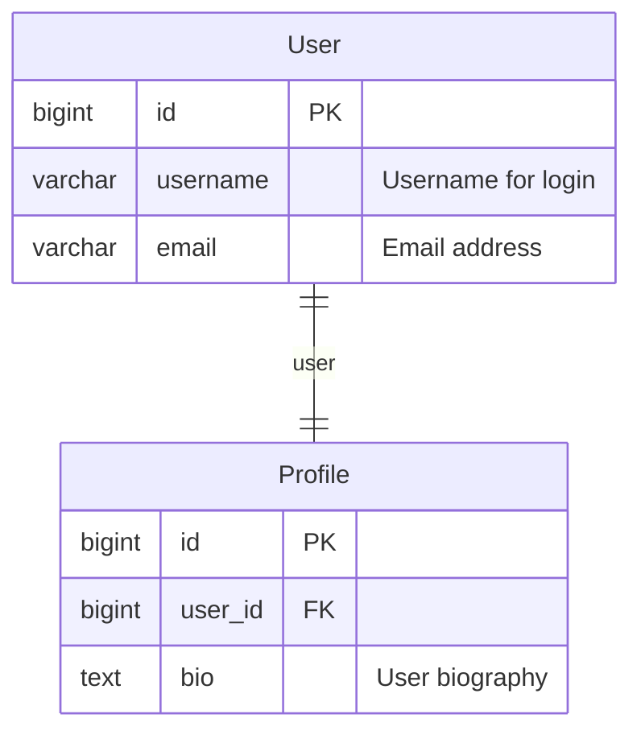

# django-er-mermaid

Generate Mermaid ER diagrams and data dictionaries from Django models.

## Features

- **Mermaid ER Diagram**: Generate ER diagrams in Mermaid syntax with `help_text` annotations
- **Data Dictionary**: Auto-generate comprehensive data dictionary tables
- **Deprecation Warnings**: Detect deprecated patterns like `ForeignKey(unique=True)` and `unique_together`
- **Flexible Output**: Write to file or stdout

## Installation

```bash
pip install django-er-mermaid
```

Add `django_er_mermaid` to your `INSTALLED_APPS`:

```python
INSTALLED_APPS = [
    'django_er_mermaid',
    # ... your other apps
]
```

## Usage

### Basic Usage

```bash
# Generate ER diagram to docs/er-diagram.md (default)
python manage.py generate_er

# Specify output file
python manage.py generate_er -o output.md

# Print to stdout
python manage.py generate_er --to-stdout
```

### Target Specific Apps

```bash
# Single app
python manage.py generate_er -a myapp

# Multiple apps
python manage.py generate_er -a app1,app2,app3
```

### Deprecation Warnings

```bash
# Include warnings in markdown output
python manage.py generate_er -w

# Include warnings in Japanese
python manage.py generate_er -w -j
```

Detects the following deprecated patterns:
- `ForeignKey(unique=True)` � Use `OneToOneField` instead
- `unique_together` � Use `UniqueConstraint` instead

## Output Example

### ER Diagram (Mermaid)



### Data Dictionary

| Field | Type | PK | FK | Null | Unique | Description |
|-------|------|----|----|------|--------|-------------|
| id | bigint |  |  |  |  |  |
| username | varchar |  |  |  |  | Username for login |
| email | varchar |  |  |  |  | Email address |

## Options

| Option | Short | Description |
|--------|-------|-------------|
| `--apps` | `-a` | Target apps (comma-separated). Default: all project apps |
| `--output` | `-o` | Output file path. Default: `docs/er-diagram.md` |
| `--to-stdout` |  | Print to stdout instead of file |
| `--include-warnings` | `-w` | Include deprecation warnings in markdown |
| `--japanese` | `-j` | Output warnings in Japanese (requires `-w`) |

## Requirements

- Python >= 3.13
- Django >= 5.0

## License

MIT License - see [LICENSE](LICENSE) for details.

## Credits

This project was inspired by [django-erd-generator](https://pypi.org/project/django-erd-generator/) by Andryo Marzuki.
